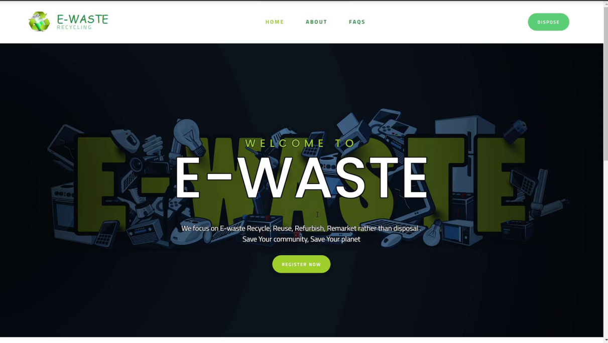
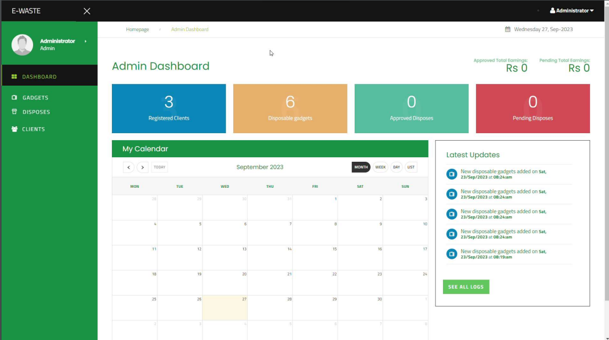
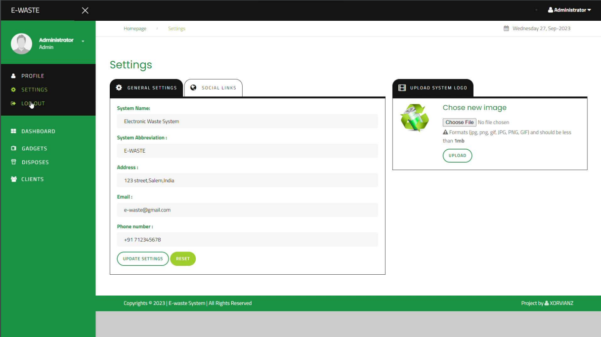
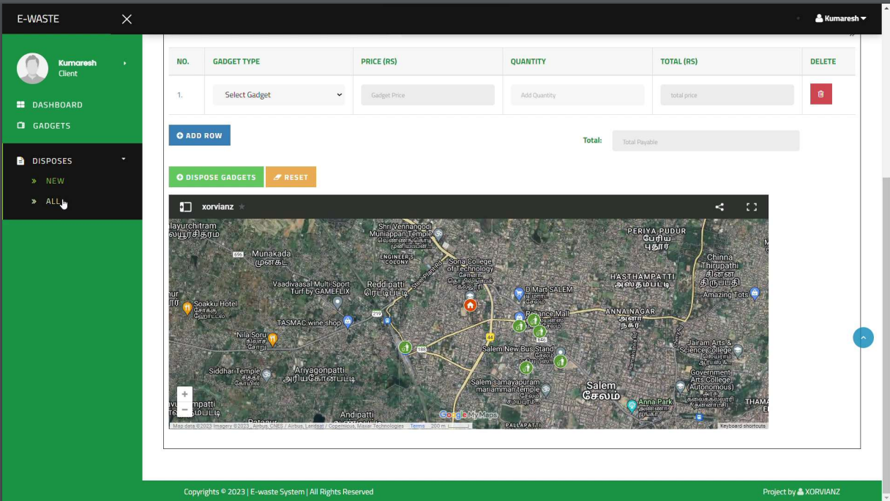

# E-WASTE MANAGEMENT SMART INDIA HACKATHON 2023 PROJECT
An advanced electronic management system(e-waste).

# PROJECT SCREENSHOTS

# SIH SUBMISSION PPT

# PROJECT FEATURES

	- User identification and authentication
	- Separate Users' (**ADMIN, CLIENT**) privilegdes
	- perform various crud functionalities e.g manage wastes, clients, gadgets
	- Generate customized reports based on the user's priviledge.
	- Plus more awesome features to be explored and to find by yourself.	
	
		- **Admin functionalities**
			+ Manage System settings
			+ add/edit/delete gadgets.
			+ Approve/Dissaprove e-waste disposes.
			+ Mangae clients.
	
		- **Client functionalities**
			+ Add disposes he/she wants to dispose.
			+ Track the disposes individually.

